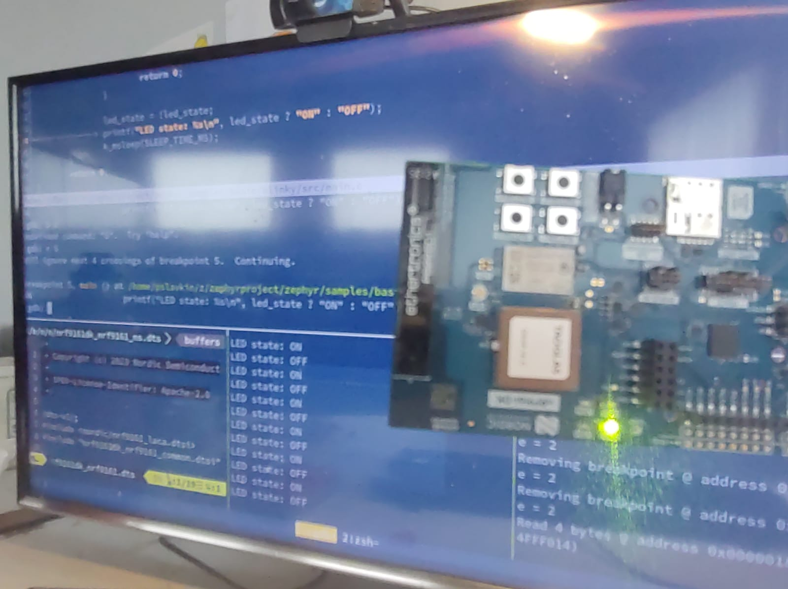

iomico zephyr course
====================



## Installation and run

```
   python3 -m env venv                                              #create a virtual environment
   source venv/bin/activate                                         #activate the virtual environment
   pip install west                                                 #install west
   west init -m git@github.com:pslavkin/zephyr_iomico_course.git \
   --mr blinky iomico_workspace                                     #init the west project
   cd iomico_workspace                                              #move to the workspace
   source completion.sh                                             #source west completion
   west update                                                      #update the west project
   python3 -m pip install -r zephyr/scripts/requirements.txt        #install the requirements
   west build -b nrf9161dk/nrf9161 -s iomico_blinky -d build        #build the project
   west flash                                                       #flash the project
```

## Using the blinky sample

launch picocom (or other terminal emulator) to see the output of the sample
press the button to see the callback in the terminal and the leds blinky

```
picocom /dev/ttyACM1  -b115200

Type [C-a] [C-h] to see available commands
Terminal ready
*** Booting Zephyr OS build v4.0.0-rc2 ***
Set up button at gpio@842500 pin 8
Press the button
Toggled led0; counter=0
Toggled led1; counter=0
Button pressed at 308907
btn pressed val: 1
Toggled led0; counter=1

```

## Overview

this blinky sample is based on the merge of two zephyr basic samples: blinky and
button.


## Pablo Slavkin <slavkin.pablo@gmail.com>

