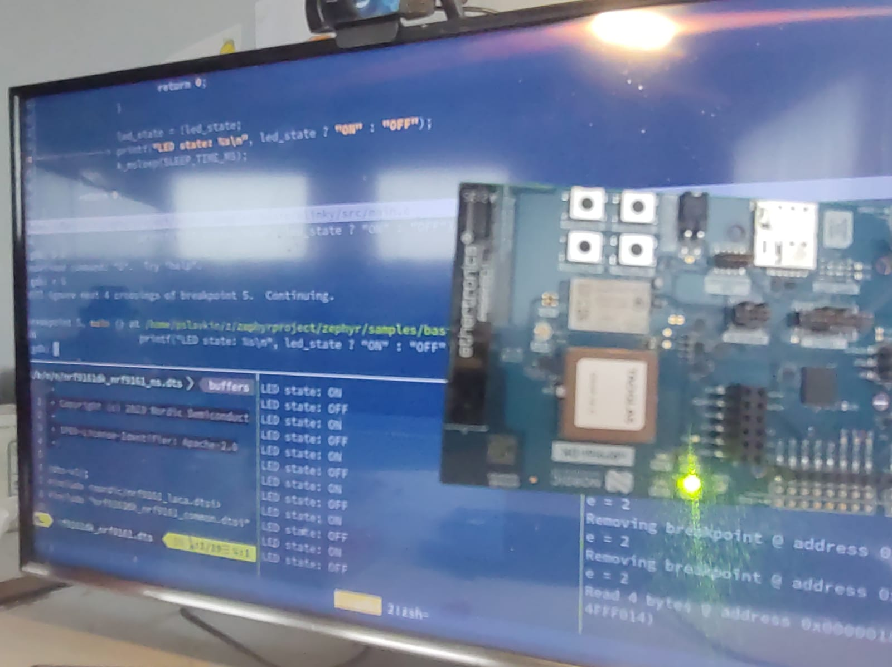

iomico zephyr course
====================

[Task0 - bringup](./doc/task1_bringup.md)

[Task1_2_3 - create T2 project + choose btw 3.6.0 and 3.7.0 + kconfig fragments](./doc/task1_2_3.md)

## Pablo Slavkin <slavkin.pablo@gmail.com>

